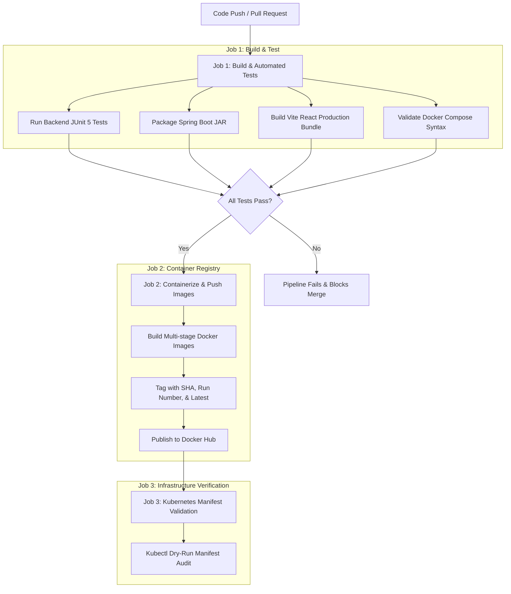

# CI/CD Pipeline Architecture with GitHub Actions

## 1. Pipeline Overview

The CI/CD workflow defined in [`.github/workflows/ci-cd.yml`](file:///c:/Projects/hotel-reservation-devops/.github/workflows/ci-cd.yml) enforces quality gates before any code is containerized or released.

---

## 2. Image Tagging Strategy

Every Docker image built in the pipeline receives multiple immutable tags:
1. **Commit SHA (`${{ github.sha }}`)**: Exact traceability to the Git commit that produced the build.
2. **Build Number (`v${{ github.run_number }}`)**: Monotonically increasing release sequence for rolling deployments.
3. **`latest`**: Points to the most recently built production release.

---

## 3. GitHub Secrets Configuration

To enable automated image publishing to Docker Hub:
- `DOCKERHUB_USERNAME`: Your Docker Hub account username.
- `DOCKERHUB_TOKEN`: Docker Hub Personal Access Token (PAT) with write permissions.
