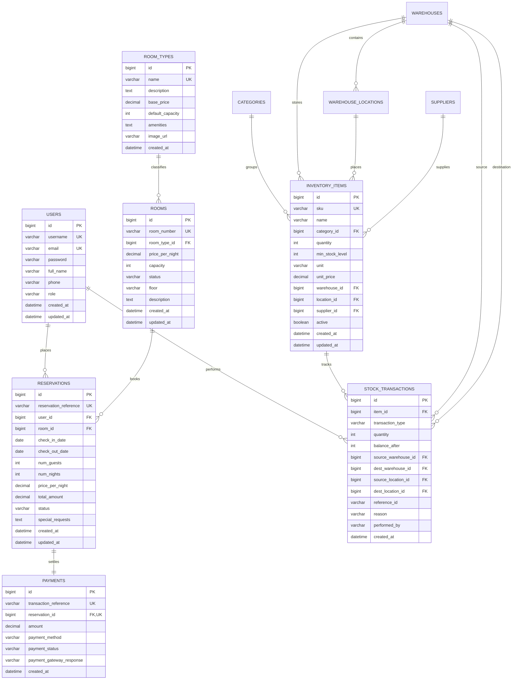

# Database Schema & Entity Design

## 1. Entity Relationship (ER) Diagram

---

## 2. Table Specifications & Constraints

### `users`
- `role`: Enum values `ROLE_CUSTOMER`, `ROLE_STAFF`, `ROLE_ADMIN`.
- Passwords hashed using Spring Security `BCryptPasswordEncoder`.

### `rooms`
- `status`: Enum values `AVAILABLE`, `BOOKED`, `CLEANING`, `MAINTENANCE`.
- `room_number`: Unique constraint index.

### `reservations`
- `status`: Enum values `PENDING`, `CONFIRMED`, `CANCELLED`, `COMPLETED`.
- `reservation_reference`: Unique format `RES-YYYY-XXXXX`.
- Calculated fields: `num_nights = checkOutDate - checkInDate`, `total_amount = num_nights * price_per_night`.

### `inventory_items`
- Low stock calculation: `quantity <= min_stock_level`.
- `quantity`: Checked non-negative constraint (`quantity >= 0`).

### `stock_transactions`
- `transaction_type`: Enum values `STOCK_IN`, `STOCK_OUT`, `TRANSFER`, `ADJUSTMENT`.
- Audit immutability: Records are insert-only and cannot be altered or deleted.

---

## 3. Safe Database Seeding

The application initializes realistic demo datasets automatically via `DataInitializer.java` without duplicating records:
- Demo Users: `admin`, `staff`, `customer` (Default password: `...123`)
- 5 Room Tiers with 12 distinct luxury rooms
- 2 Warehouses (`WH-MAIN` Central Logistics and `WH-HK-01` Floor Pantry) with 4 bin locations
- 4 Inventory Categories and 8 realistic hospitality consumable items
- Low-stock inventory items to showcase real-time alerts immediately on first run.
